# System Design

How the Competitive Intelligence Platform is built: users and flows, architecture, pipeline, data model, comparison engine, LLM layer, jobs, deployment and non-functional design.

- Product spec: `docs/PROJECT_SPEC.md` (§ references below point there).
- Stack decisions: `docs/DECISIONS.md` (D-001 and D-002 accepted).
- Diagrams use Mermaid. Preview them in VS Code (Mermaid extension) or on GitHub.

---

## 1. Users

### 1.1 Personas

| Persona | Example | Main goal | Key screens |
|---|---|---|---|
| **Business owner** (non-technical) | Restaurant owner, D2C founder | "Where am I behind, and what should I look into?" | Dashboard, lagging report, weekly brief, alerts |
| **Founder / PM** (software) | B2B SaaS founder | Feature and pricing gaps, competitor launches | Offering matrix, head-to-head, timeline |
| **Marketing / strategy** | Marketing lead at an SMB | Positioning, campaigns, review themes | Leading report, review themes, patterns |

All personas use the same product. MVP has **one user per workspace** (no roles).

### 1.2 Use cases

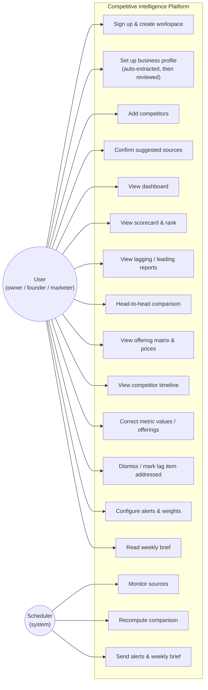

### 1.3 User journey

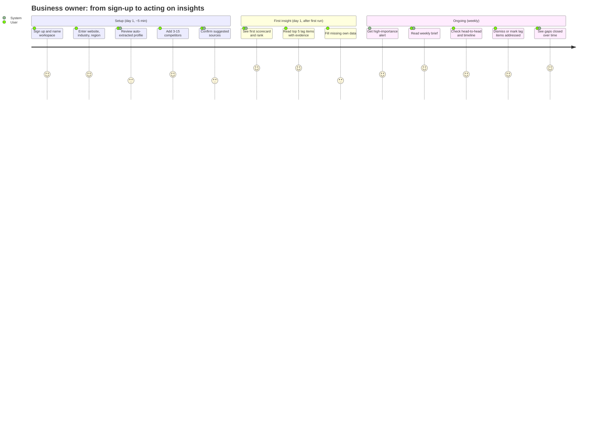

### 1.4 Onboarding flow

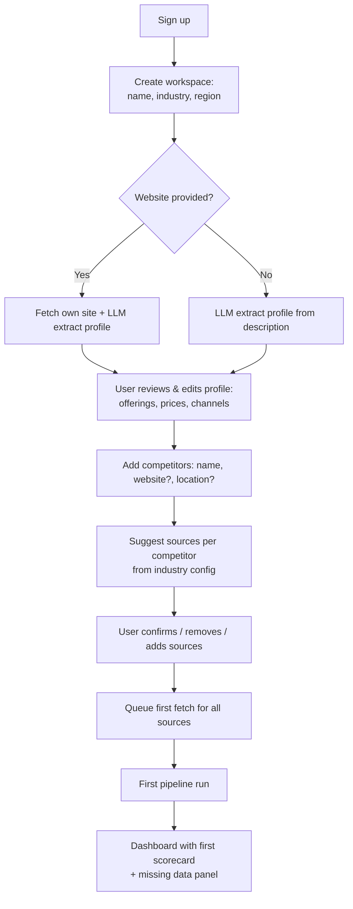

### 1.5 App navigation (sitemap)

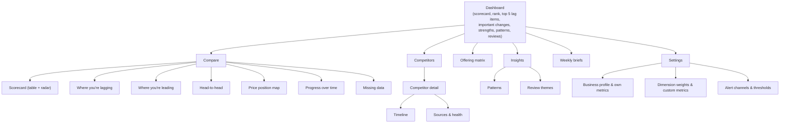

---

## 2. System context

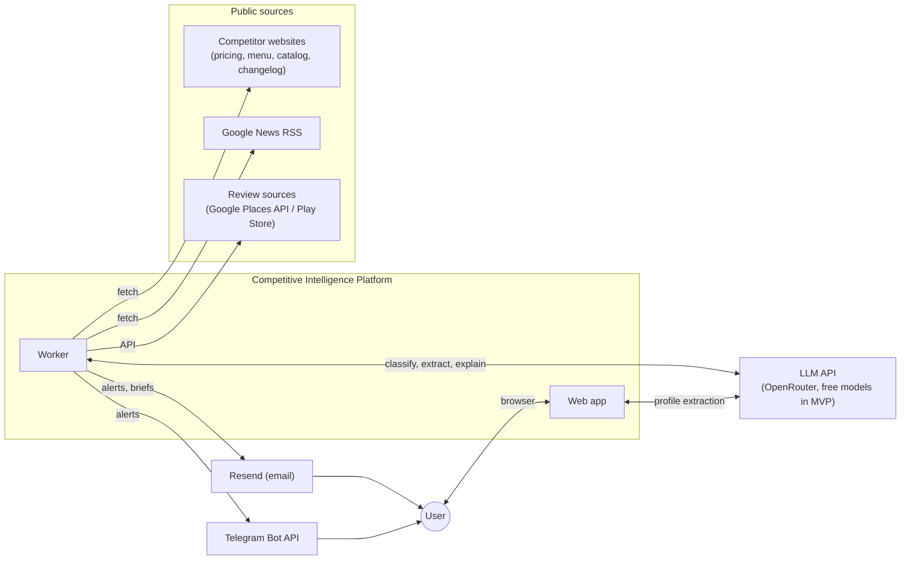

---

## 3. Architecture (containers)

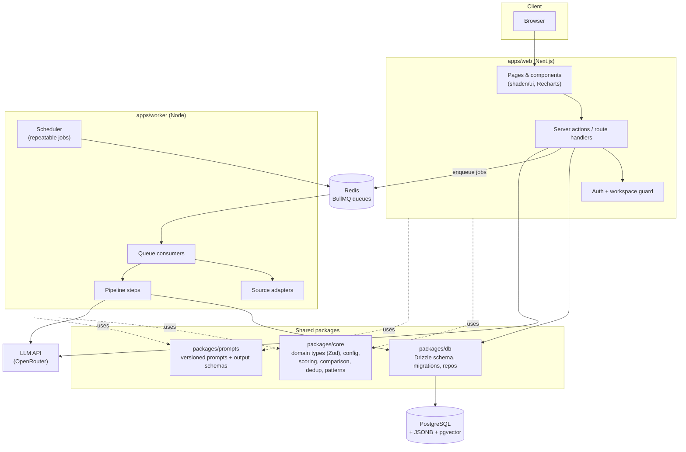

**Responsibilities**

| Component | Does | Does NOT |
|---|---|---|
| `apps/web` | UI, auth, CRUD (profile, competitors, sources, corrections, settings), reads computed results, enqueues on-demand jobs | Long-running fetch or LLM batch work |
| `apps/worker` | Scheduled fetching, pipeline steps, recompute, patterns, reviews, alerts, briefs | Serve HTTP to users |
| `packages/core` | Pure logic: Zod types, config, importance, comparison status, scoring, priority, dedup keys, pattern grouping | I/O (no DB, no network) → easy unit tests |
| `packages/db` | Schema, migrations, typed queries scoped by `workspaceId` | Business rules |
| `packages/prompts` | Prompt templates + version + output Zod schema | Thresholds or scoring (these live in config) |

### 3.1 Repository layout

```
ai-competitor-analysis/
├─ apps/
│  ├─ web/                 # Next.js app
│  │  └─ src/app/(auth)/, (app)/dashboard, compare/, competitors/, matrix/, briefs/, settings/
│  └─ worker/
│     └─ src/
│        ├─ queues/        # queue names, job payload schemas
│        ├─ jobs/          # one file per job type
│        ├─ adapters/      # website.ts, googleNews.ts, googleReviews.ts
│        └─ scheduler.ts
├─ packages/
│  ├─ core/
│  │  └─ src/
│  │     ├─ domain/        # Zod schemas + TS types (§4)
│  │     ├─ config/        # dimensions, industries/, importance, thresholds
│  │     ├─ comparison/    # status, scoring, lagItems, priority
│  │     ├─ events/        # dedupKey, importance
│  │     └─ patterns/
│  ├─ db/                  # drizzle schema, migrations, repositories
│  └─ prompts/             # extractEvent.v1.ts, mapOffering.v1.ts, explainLag.v1.ts, brief.v1.ts ...
├─ docs/
└─ CLAUDE.md
```

---

## 4. Data pipeline

### 4.1 End-to-end flow

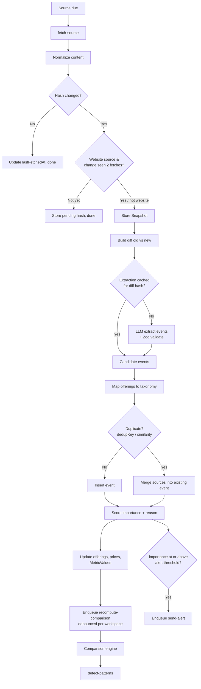

### 4.2 Sequence: competitor raises a price → user gets an alert

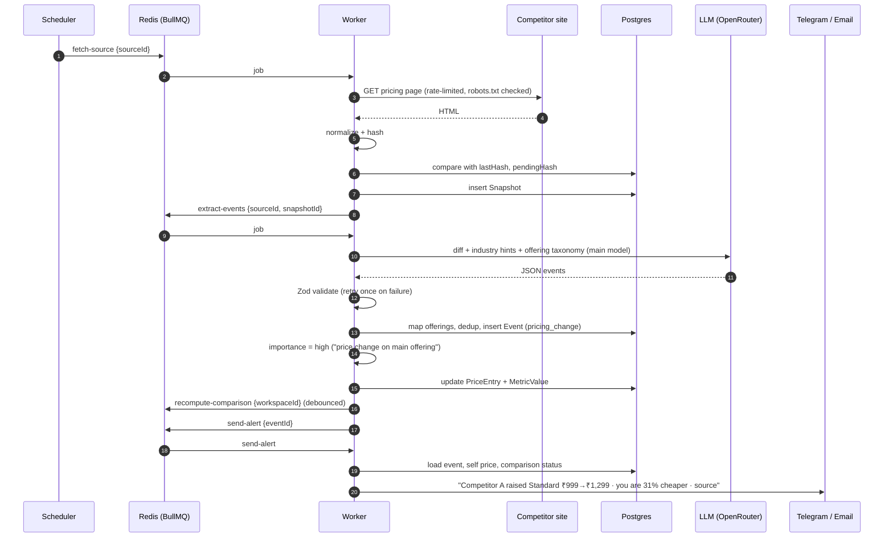

### 4.3 Pipeline step rules

| Step | Input → Output | Idempotency key | Failure handling |
|---|---|---|---|
| fetch-source | Source → Snapshot? | `sourceId:scheduledSlot` | Retry with exponential backoff; `errorCount++`; mark source `unhealthy` after N failures; never blocks other sources |
| extract-events | Snapshot + previous → Events | `snapshotId:promptVersion` | Retry invalid JSON once, then write to `extraction_failures` |
| process-event | Candidate event → stored Event | `dedupKey` | Transaction per event |
| recompute-comparison | Workspace → ComparisonResults, Scorecard, Lag/Strength items | `workspaceId` (debounce 5 min) | Safe to re-run; writes a new Scorecard version |
| detect-patterns | Workspace events (90 days) → Patterns | `workspaceId:date` | Re-run replaces open patterns |
| analyze-reviews | Review snapshots → ReviewThemes | `competitorId:periodStart` | Re-run replaces themes for the period |
| send-alert | Event → notification | `eventId:channel` | Retry; record delivery in `alert_deliveries` |
| generate-brief | Workspace week → Brief | `workspaceId:periodStart` | Generate once, deliver per channel with retry |

---

## 5. Data model

### 5.1 Entity relationships

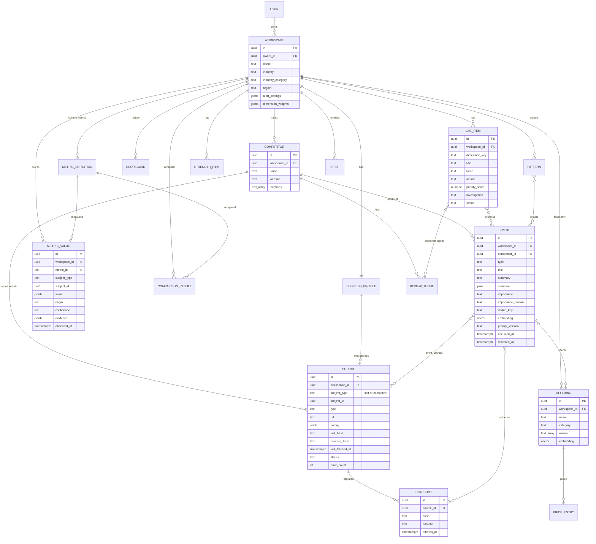

### 5.2 Storage decisions

| Topic | Decision |
|---|---|
| Multi-tenancy | Every table carries `workspace_id`; all queries go through repositories that require it. |
| Flexible payloads | `Event.structured`, `MetricValue.value`, `evidence`, settings are JSONB validated by Zod on write. |
| Embeddings | `pgvector` columns on `event` and `offering` (dedup + offering matching). |
| Snapshots | MVP: normalized text in Postgres (compressed by TOAST). Later: object storage (S3/R2) with key in DB. |
| History | `scorecard` and `metric_value` are append-only; "current" = latest by `observed_at` / `computed_at`. |
| User overrides | `origin = user_entered` always wins over `auto_detected` for the same metric and subject. |
| Metric definitions | Built-in ones live in code config (`packages/core/config/industries/*`); only custom metrics are stored in DB. |

---

## 6. Offering mapping (taxonomy)

The hardest correctness problem (§9): a wrong mapping creates wrong gaps with high confidence.

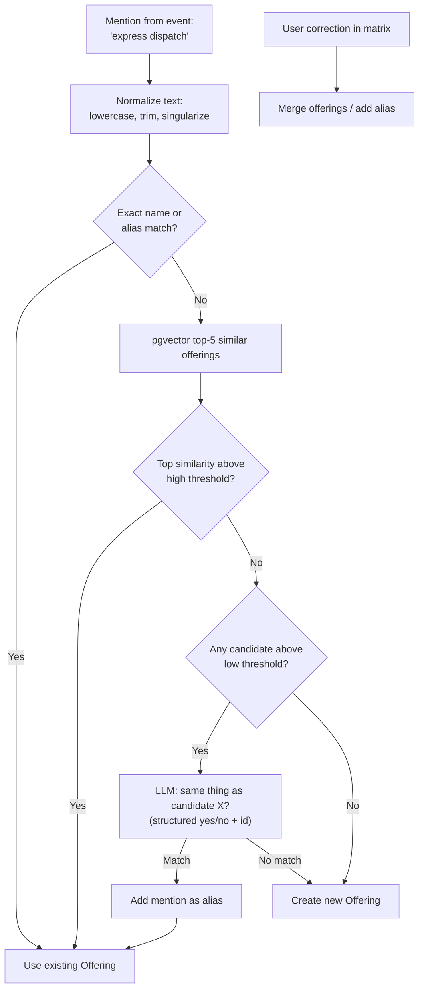

Thresholds live in `packages/core/config/thresholds.ts`.

---

## 7. Comparison engine (core, §2A)

Runs in `recompute-comparison`, as pure functions in `packages/core/comparison`. The LLM is used only at the end to write text.

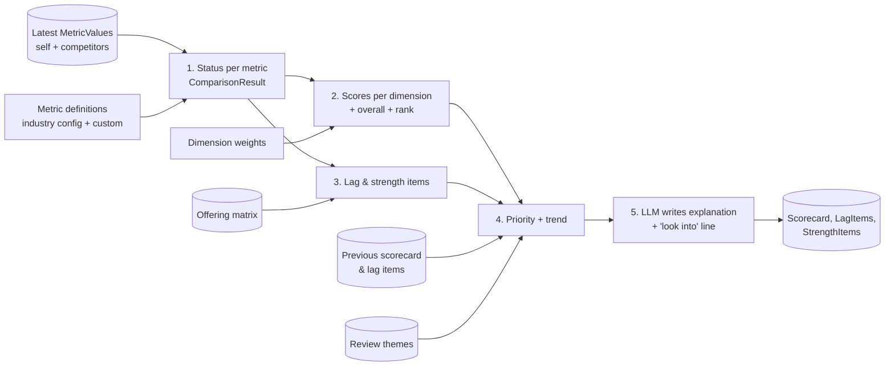

### 7.1 Metric status (default rules, all values in config)

For one metric, compare self with each competitor that has a **known** value:

- **Per competitor:** `ahead` / `behind` / `equal`. Booleans compare directly. Numbers use `higherIsBetter` with a tolerance (default ±5%) for `equal`.
- `known` = number of competitors with a value.

| Status | Rule |
|---|---|
| `unknown` | Self value unknown **or** `known < minKnownCompetitors` (default 2) |
| `unique` | Boolean metric, self = true, all known competitors = false |
| `lagging` | `ahead / known > 0.5` |
| `leading` | `behind / known > 0.5` |
| `at_par` | Otherwise |

### 7.2 Scores

1. **Metric score (0–100) per subject:** boolean → 100 or 0; numeric → min-max normalized across subjects in the direction of `higherIsBetter` (all equal → 100); unknown → excluded.
2. **Dimension score:** mean of known metric scores. `null` if coverage (known ÷ defined metrics) < `minCoverage` (default 0.3). Coverage is always shown next to the score.
3. **Overall score:** weighted mean of non-null dimension scores, with weights re-normalized over available dimensions.
4. **Rank:** order subjects by overall score.

### 7.3 Lag items and priority

- Sources: every `lagging` metric, plus offering gaps (offerings the user lacks that ≥ `gapMinCompetitors` (default 2) competitors have).
- `trend`: compared with the previous run. `new` = not present before; `widening` = more competitors ahead or a larger value gap; `narrowing` = the opposite; `stable` otherwise.
- Priority (weights in config):

```
priority = dimensionWeight
         × shareOfCompetitorsAhead
         × impact            (event-type weight × review demand × recency decay)
         × trendMultiplier   (widening 1.3 > new 1.2 > stable 1.0 > narrowing 0.8)
```

- `dismissed` or `addressed` items stay hidden until **new evidence** (a new event or metric value) touches the same metric or offering.

---

## 8. Importance scoring & pattern detection

### 8.1 Importance (deterministic)

```
score = baseWeight[eventType]                      // config, adjustable per industry
      + (touches offering user LACKS  ? +2 : 0)
      + (touches offering user HAS    ? +1 : 0)
      + (part of active pattern       ? +1 : 0)
      + (in user's region             ? +1 : 0)    // local businesses
level = score >= high ? 'high' : score >= medium ? 'medium' : 'low'
```

`importanceReason` is assembled from the rules that fired (e.g. "Pricing change on an offering you also sell").

### 8.2 Patterns

1. Take events from the last `windowDays` (default 90).
2. Group by `offering.category`, `event.type`, and `(type, offering)`.
3. Create a Pattern if distinct competitors ≥ 3 **or** ≥ 50% of tracked competitors.
4. The LLM writes only `summary` ("3 of 6 competitors raised prices in 90 days").

---

## 9. LLM layer

**Provider (D-002):** MVP uses **free models on OpenRouter** (OpenAI-compatible API). The code is provider-agnostic: provider and models come from env, so moving to a paid model later is a config change, not a code change.

```
LLM_PROVIDER=openrouter            # later: openrouter (paid model) or anthropic
LLM_MODEL_MAIN=nvidia/nemotron-3-ultra-550b-a55b:free
LLM_MODEL_BACKUP=google/gemma-4-26b-a4b-it:free # used on rate limit / repeated schema failure
LLM_MODEL_FAST=                    # optional later: split high-volume tasks to a cheaper/faster model
EMBEDDING_MODEL=<free embedding model id>   # for pgvector dedup + offering match
```

| Task | Model role | Input | Output schema | Prompt |
|---|---|---|---|---|
| Profile extraction | main | Own site text or description | `BusinessProfileDraft` | `extractProfile.v1` |
| Event extraction | main | **Diff only** + industry hints + offering names | `ExtractedEvent[]` | `extractEvents.v1` |
| Offering match | main | Mention + top candidates | `{ matchId \| null }` | `mapOffering.v1` |
| Metric extraction | main | Snapshot excerpt + metric definitions | `MetricValueDraft[]` | `extractMetrics.v1` |
| Review themes | main | Batched reviews | `ReviewTheme[]` | `reviewThemes.v1` |
| Lag/strength explanation | main | Computed item + evidence | `{ explanation, investigation }` | `explainItem.v1` |
| Pattern summary | main | Grouped events | `{ summary }` | `patternSummary.v1` |
| Weekly brief | main | Stored week data only | `BriefSections` | `weeklyBrief.v1` |

**Rules**

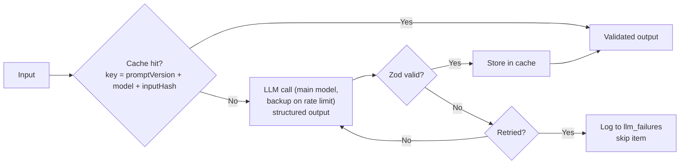

- A single `llm` client wrapper in `packages/prompts` handles model choice, caching, validation, retries, token logging and the cost budget per workspace.
- Prompts never contain thresholds or scoring rules; they receive computed facts.
- Output that makes claims must reference provided evidence ids; the wrapper drops text with unknown ids.
- `promptVersion` **and model id** are stored on every output row, so results can be compared after a model switch.
- Free models: never send private user data that isn't needed; public competitor content is fine. Check each model's data-retention policy.

---

## 10. Jobs & scheduling

| Queue | Trigger | Default schedule | Concurrency |
|---|---|---|---|
| `fetch-source` | Scheduler, "refresh now" | website/pricing/menu: 24h · news: 6h · reviews: 24h | Per-domain limiter (1 request / 10s) |
| `extract-events` | New snapshot | n/a | Limited by LLM rate budget |
| `process-event` | Extracted events | n/a | Per workspace serial |
| `recompute-comparison` | Event, metric change, user correction | Daily + debounced 5 min | 1 per workspace |
| `analyze-reviews` | New review snapshots | Daily | Low |
| `detect-patterns` | After recompute | Daily | 1 per workspace |
| `send-alert` | High-importance event | n/a | High |
| `generate-brief` | Scheduler | Weekly (workspace timezone, Monday 8am) | Low |

Failed jobs go to a dead-letter list visible in an internal admin page.

---

## 11. Source adapters

```ts
interface SourceAdapter {
  type: SourceType;
  fetch(source: Source, ctx: FetchContext): Promise<RawContent>; // respects rate limit + robots.txt
  normalize(raw: RawContent): NormalizedContent; // strip nav, footer, banners, timestamps
  diff?(prev: NormalizedContent, next: NormalizedContent): Diff; // default: text/line diff
  items?(content: NormalizedContent): Item[]; // feeds/reviews: new items instead of diff
}
```

| Adapter (MVP) | Method | Change detection |
|---|---|---|
| `website` (incl. pricing, menu) | fetch + Readability/cheerio; Playwright if `config.jsRendered` | Normalized hash, confirmed across 2 fetches |
| `google_news` | RSS feed for competitor-name query | New item ids |
| `google_business` / `play_store` | Official API where required | New review ids + rating/count metrics |

Adding a source type = one new adapter + a config entry. No pipeline changes.

---

## 12. Deployment

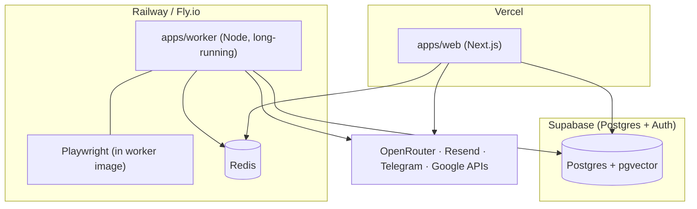

Environments: `local` (Supabase + Upstash free tiers, no Docker needed), `staging`, `production`. Redis: Upstash. Migrations run in CI before deploy.

---

## 13. Non-functional design

| Area | Approach |
|---|---|
| **Reliability** | Idempotent jobs, retries with backoff, dead-letter queue, per-source isolation, source health status in UI |
| **Precision (noise)** | Normalization before hashing, 2-fetch confirmation for websites, dedup, importance thresholds, real-time alerts only for `high` |
| **Trust** | Every insight stores evidence (source, snapshot, excerpt); UI shows origin (auto / user) and confidence; unknowns shown as unknown |
| **Security** | Auth on all routes; owner/workspace-scoped repositories; RLS enabled with no policies so Supabase's public Data API can't read app tables (the app connects as the DB owner); secrets only in env; no scraping behind logins; SSRF guard on user-provided URLs (block private IPs) |
| **Compliance** | robots.txt respected, per-domain rate limits, official APIs where terms require, identifiable user agent |
| **Cost** | Free OpenRouter models in MVP (D-002), diffs only to the LLM, content-hash cache, batching, per-workspace token budget and logging |
| **Observability** | Structured logs (pino) with `workspaceId`/`jobId`; job metrics (success, latency, retries); LLM token and cost per task; error tracking (Sentry) |
| **Scale (MVP target)** | ~100 workspaces × 10 competitors × 3–5 sources ≈ 5k fetches/day: one worker instance is enough; scale by adding worker replicas |
| **Testing** | Unit tests for `packages/core` (status, scoring, priority, importance, patterns, dedup); fixture-based adapter tests (HTML before/after); prompt eval sets per industry with expected events |
